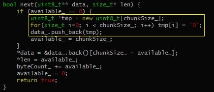

# About

Compare various data serialization libraries for C++.

* [Thrift](http://thrift.apache.org/)
* [Protobuf](https://code.google.com/p/protobuf/)
* [Boost.Serialization](http://www.boost.org/libs/serialization)
* [Msgpack](http://msgpack.org/)
* [Cereal](http://uscilab.github.io/cereal/index.html)
* [Avro](http://avro.apache.org/)
* [Capnproto](https://capnproto.org/)
* [Flatbuffers](https://google.github.io/flatbuffers/)
* [YAS](https://github.com/niXman/yas)

# Build

This project does not have any external serialization libraries dependencies. All (boost, thrift etc.) needed libraries are downloaded and built automatically, but you need enough free disk space (approx. 2.3G) to build all components. To build this project you need a compiler that supports C++14 features. Project was tested with Clang and GCC compilers.

1. `git clone https://github.com/thekvs/cpp-serializers.git`
1. `cd cpp-serializers`
1. `mkdir build`
1. `cd build`
1. `cmake -DCMAKE_BUILD_TYPE=Release ..`
1. `cmake --build .`

# Usage

```
$ ./benchmark -h
Benchmark various C++ serializers
Usage:
  benchmark [OPTION...]

  -h, --help             show this help and exit
  -l, --list             show list of supported serializers
  -c, --csv              output in CSV format
  -i, --iterations arg   number of serialize/deserialize iterations
  -s, --serializers arg  comma separated list of serializers to benchmark
```

* Benchmark **all** serializers, run each serializer 100000 times:
```
$ ./benchmark -i 100000
```
* Benchmark only **protobuf** serializer, run it 100000 times:
```
$ ./benchmark -i 100000 -s protobuf
```
* Benchmark **protobuf** and **cereal** serializers only, run each of them 100000 times:
```
$ ./benchmark -i 100000 -s protobuf,cereal
```

# Results - 1

Following results were obtained running 100000 serialize-deserialize operations 3 times and then averaging results on a server, which equits with Intel Xeon E5-2650 processor and 2400MHz, 32G DDR4 memory. And the operating system is ubuntu 16.04 server
Exact versions of libraries used are:

* thrift 0.12.0
* protobuf 3.7.0
* boost 1.69.0
* msgpack 3.1.1
* cereal 1.2.2
* avro 1.8.2
* capnproto 0.7.0
* flatbuffers 1.10.0
* YAS 7.0.2

| serializer     | object's size (bytes) | avg. total time (ms)|
| -------------- | --------------------- | ------------------- |
| thrift-binary  | 17017                 | 2287                |
| thrift-compact | 13378                 | 3675                |
| protobuf       | 16116                 | 3642                |
| boost          | 17470                 | 1550                |
| msgpack        | 13402                 | 4203                |
| cereal         | 17416                 | 1323                |
| avro           | 16384                 | 5387                |
| yas            | 17416                 | 407                 |
| yas-compact    | 13321                 | 2319                |


For capnproto and flatbuffers since they already store data in a "serialized" form and serialization basically means getting pointer to the internal storage, we measure full **build**/serialize/deserialize cycle. In the case of other libraries we measure serialize/deserialize cycle of the already built data structure.

| serializer     | object's size (bytes) | avg. total time (ms) |
| -------------- | --------------------- | -------------------- |
| capnproto      | 17768                 | 565                  |
| flatbuffers    | 17632                 | 606                  |


# Results-2

In order to see the time of serialization and deserialization respectively, we modify benchmark.cpp to serialize-deserilize 100000 same objects, and record serialization & deserialization time.
However, we need to do some preprocess to warm-up , in order to avoid the effect of **memory allocation and memory copy** when using some classes which would allocate memory dynamically during running, like std::string, std::ostringstream etc.
Specially, we  modify the constructor of **class sbuffer** in **src/msgpack/sbuffer**, and **next()** of **MemoryOutputStream** in **lang/c++/impl/Stream.cc** (like the following picture)

~[msgpack](images/msgpack.JPG)
